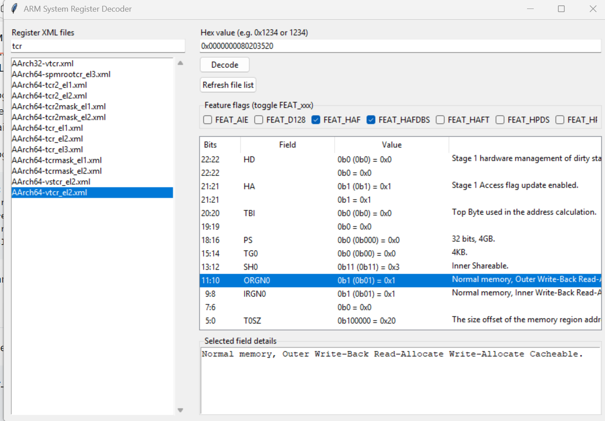
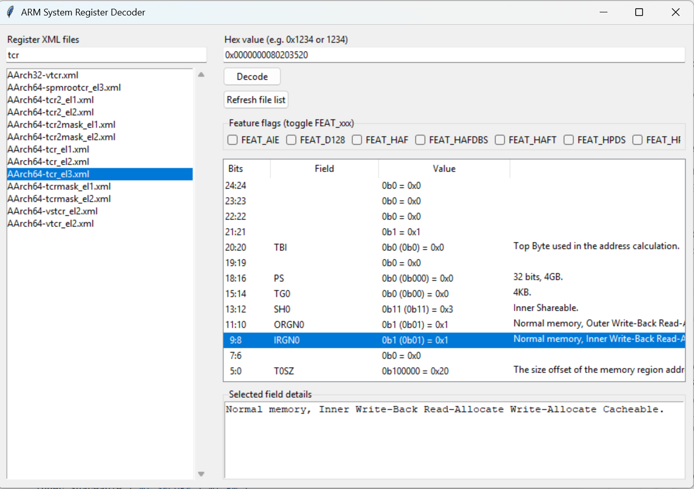

# arm_system_register_parser
A python parser for decoding arm aarch32 and aarch64 system registers

This project is to help engineers, who are working on armv7-ar, armv8-a, armv8-r and armv9-a platforms, to decode the value (in Hex format) in all aarch32 and aarch64 system registers, so that they can debug a problem or find information easier.

It requires Python3, and please download the arm system register XML files from arm website, go to https://developer.arm.com/downloads/-/exploration-tools , and click 'Download XML' in Arm Architecture System Registers Tab. Then unzip the downloaded file, and put those *.xml files to the project folder ./sys_reg_xml .

#Updated on March 2026
Provide an Python UI for easier usage

Run ui_app.py

